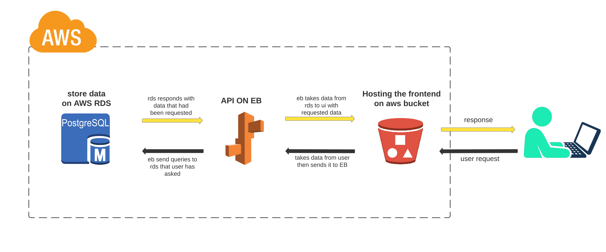
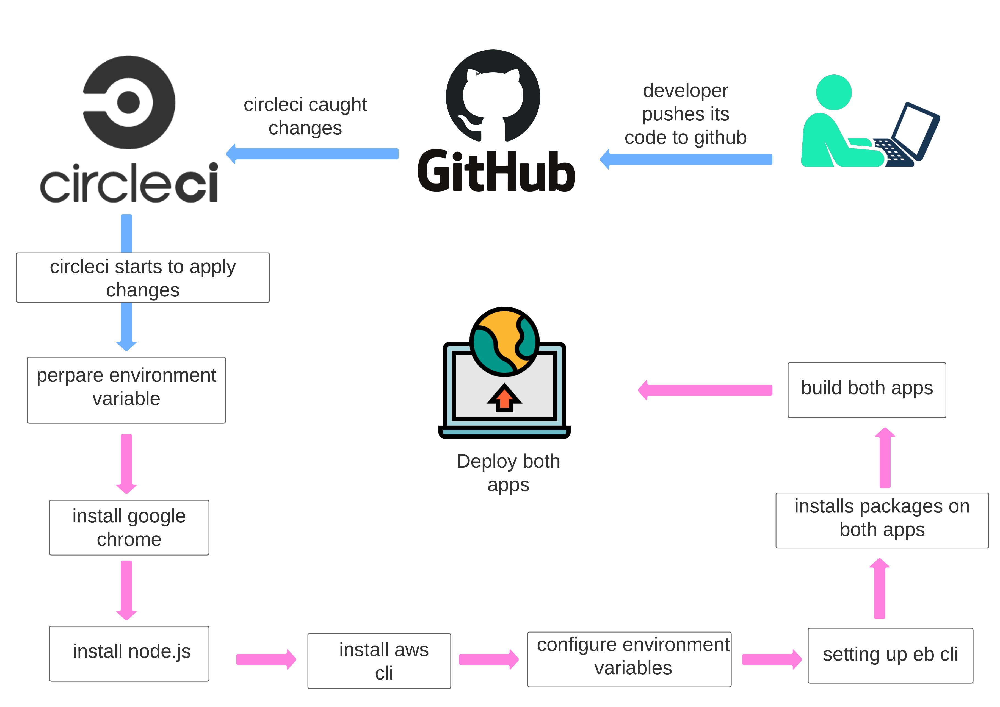

[](https://app.circleci.com/pipelines/github/ahmad-elshowair/elshowair-udagram)

# Udagram
the udagram application is a full stack project that is uploaded and deployed on [AWS](https://aws.amazon.com/) services: 
- RDS
- S3
- Elastic Beanstalk
## Project Instructions

* ### application workflow:
    
* ### pipeline workflow:
    
* ### Dependency:
    the dependencies I'm using within udagram project are [here](docs/app-dependency.md)

* ### CI/CD process:
    using continuos integration and continuos deliver for install, build, deploy the udagram project through [CircleCi](https://app.circleci.com/pipelines/github/ahmad-elshowair/elshowair-udagram?filter=all), [more detail](docs/pipelines.md)
* ### HOSTING:
    - the front end hosted on that [link](http://elshowair-udagram.s3-website-us-east-1.amazonaws.com)

* ### Environment variables:
    *for running the application locally need have the following env variables:*
    ```
    POSTGRES_USERNAME
    POSTGRES_PASSWORD
    POSTGRES_DB
    POSTGRES_HOST
    POSTGRES_PORT
    PORT=8080
    URL
    JWT_SECRET
    RDS_DIALECT
    AWS_REGION
    AWS_PROFILE
    AWS_BUCKET
    AWS_ACCESS_KEY_ID
    AWS_SECRET_ACCESS_KEY
    ```

* ### Installation:
    to install the node.js packages you use could both:

    ```
    npm install

    yarn
    ```
* ### start up:
    * start the front-end app:
    `
    cd udagram-frontend && npm run start && cd ../
    `

    * start the back-end app:
    `
    cd udagram-api && npm run dev && cd ../
    `
* ### Built With:
    - [Angular](https://angular.io/) - Single Page Application Framework
    - [Node](https://nodejs.org) - Javascript Runtime
    - [Express](https://expressjs.com/) - Javascript API Framework
