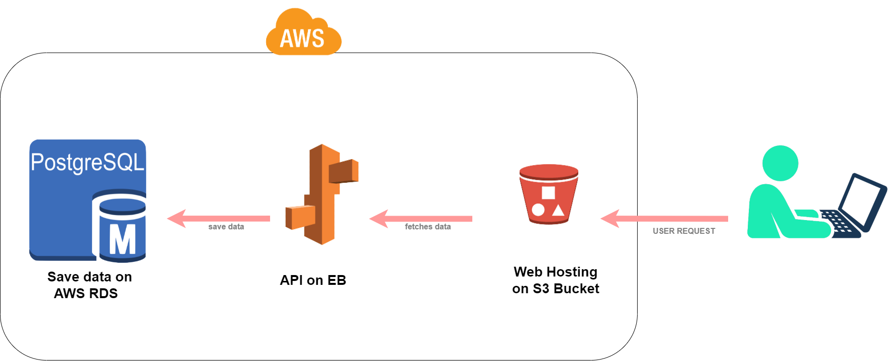

# Udagram
the udagram application is a full stack project that is uploaded and deployed on [AWS](https://aws.amazon.com/) services: 
- RDS
- S3
- Elastic Beanstalk
## Project Instructions

### application workflow:

### Dependency:
the dependencies I'm using within udagram project are [here](docs/app-dependency.md)

### CI/CD process:
using continuos integration and continuos deliver for install, build, deploy the udagram project, [more detail](docs/pipelines.md)
### HOSTING:
- the front end hosted on that [link](http://elshowair-udagram.s3-website-us-east-1.amazonaws.com)

### Built With:

- [Angular](https://angular.io/) - Single Page Application Framework
- [Node](https://nodejs.org) - Javascript Runtime
- [Express](https://expressjs.com/) - Javascript API Framework
